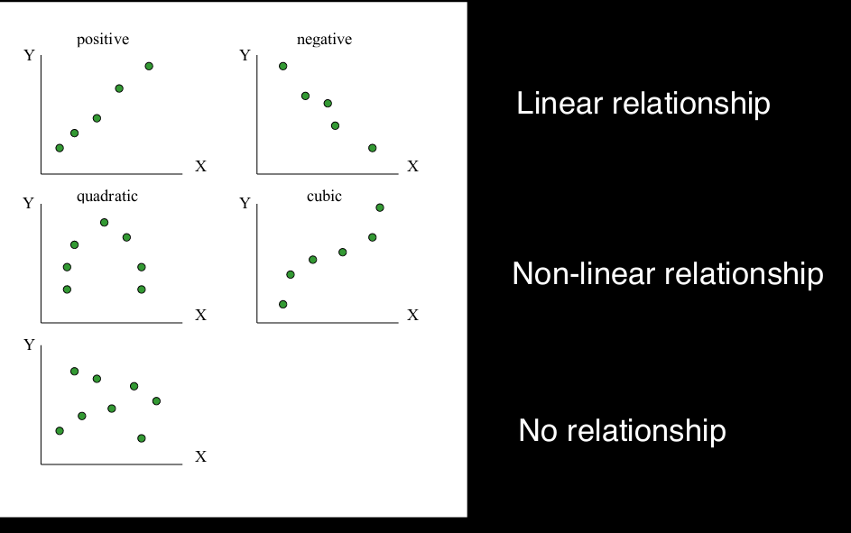
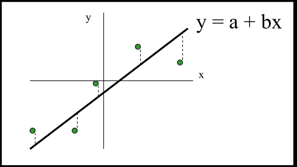
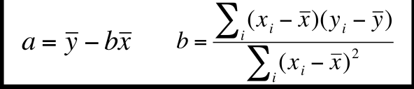

# Linear Models

Relations can be modeled as being linear, but a low R value or no significance when fitting data to a linear model does not imply there is no relationship.

Data could either be in a linear relationship (positive or negative), a non-linear relationship (quadratic, cubic), or there could be no clear relationship. In the latter case, this also doesn't imply there is no relationship, but instead that a more rigorous method is needed to discern the relationship - neural networks. 

## Constructing Models

In the classic scenario, a line is fit via least squares (minimize sum of the squared residuals).

 

* heart rate vs body mass

You can test how significant one's model is via hypothesis tests (T-test: [link](https://blog.minitab.com/blog/statistics-and-quality-data-analysis/what-is-a-t-test-and-why-is-it-like-telling-a-kid-to-clean-up-that-mess-in-the-kitchen)). If the sample size is small, use the T-distribution for calculating p. If not, use a [wallis test](https://en.wikipedia.org/wiki/Kruskal%E2%80%93Wallis_one-way_analysis_of_variance). 

### Questions

Calculating p-value? --> do examples

## Multiple Regression

Can use multiple variables to predict some outcome. These covariates can be continuous or categorical, can be transformations, and can be interactions between covariates. In these scenarios, coefficients then represent the expected change in the outcome variable per each unit increase of said covariate variable, if the other covariates are held constant (adjust for them).